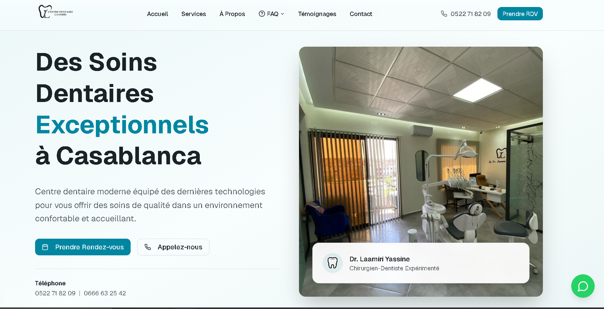

# 🦷 Dental Clinic Website

Modern and professional dental clinic website built with Next.js and Tailwind CSS.

## ✨ Features
- Responsive design
- Modern UI / UX
- Appointment section
- Services showcase
- Contact information
- Optimized images
- Clean and scalable architecture

## 🛠️ Tech Stack
- Next.js
- React
- Tailwind CSS
- TypeScript
- Shadcn UI
- Lucide Icons

## 📸 Screenshots
## 📸 Screenshots




## 🚀 Getting Started

### 1. Clone the repository
```bash
git clone https://github.com/meriemeouasif/dental-clinic-website.git
